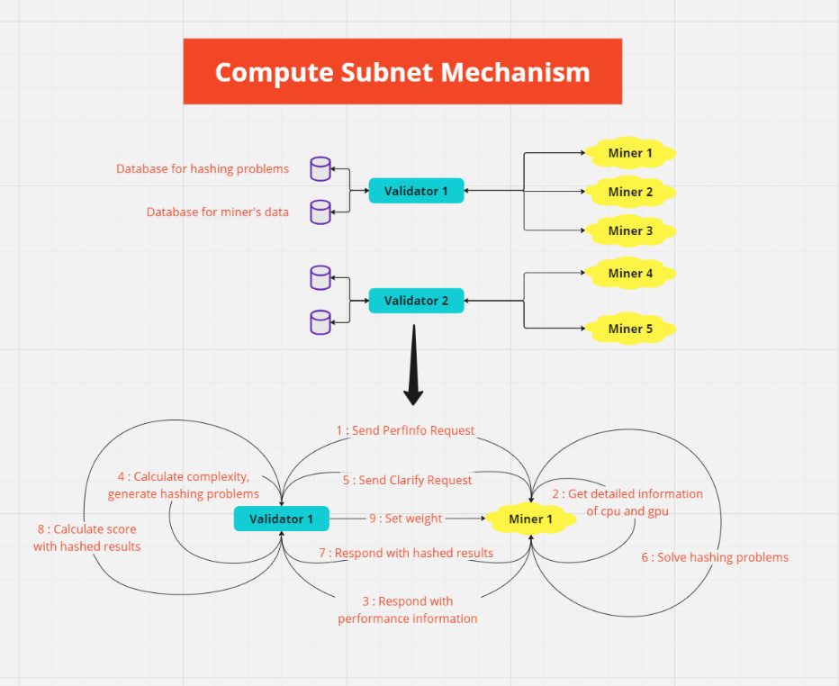

<div align="center">

# **Bittensor Compute Subnet** <!-- omit in toc -->
[](https://discord.gg/bittensor)
[](https://opensource.org/licenses/MIT) 

---

### The Incentivized Internet <!-- omit in toc -->

[Discord](https://discord.gg/bittensor) • [Network](https://taostats.io/) • [Research](https://bittensor.com/whitepaper)

</div>

---

This template contains all the necessary files and functions to define Bittensor's Compute Subnet. You can try running miners on netuid 15 in Bittensor's test network.

# Introduction
The Bittensor blockchain hosts multiple self-contained incentive mechanisms 'subnets'. Subnets are playing fields through which miners (those producing value) and validators (those producing consensus) determine together the proper distribution of TAO for the purpose of incentivizing the creation of value, i.e. generating digital commodities, such as intelligence, or data. Each consists of a wire protocol through which miners and validators interact and their method of interacting with Bittensor's chain consensus engine [Yuma Consensus](https://bittensor.com/documentation/validating/yuma-consensus) which is designed to drive these actors into agreement about who is creating value.

This repository is a compute-composable subnet. This subnet has integrated various cloud platforms (e.g., Runpod, Lambda, AWS) into a cohesive unit, enabling higher-level cloud platforms to offer seamless compute composability across different underlying platforms. With the proliferation of cloud platforms, there's a need for a subnet that can seamlessly integrate these platforms, allowing for efficient resource sharing and allocation. This compute-composable subnet will enable nodes to contribute computational power, with validators ensuring the integrity and efficiency of the shared resources.

- `compute/protocol.py`: The file where the wire-protocol used by miners and validators is defined.
- `neurons/miner.py`: This script which defines the miner's behavior, i.e., how the miner responds to requests from validators.
- `neurons/validator.py`: This script which defines the validator's behavior, i.e., how the validator requests information from miners and determines scores.
</div>

---

# Installation
This repository requires python3.8 or higher. To install, simply clone this repository and install the requirements.
```bash
git clone https://github.com/neuralinternet/Compute-Subnet
cd Compute-Subnet
python -m pip install -r requirements.txt
python -m pip install -e .
```

</div>

---

Prior to running a miner or validator, you must [create a wallet](https://github.com/opentensor/docs/blob/main/reference/btcli.md) and [register the wallet to a netuid](https://github.com/opentensor/docs/blob/main/subnetworks/registration.md). Once you have done so, you can run the miner and validator with the following commands.
```bash
# To run the miner
python -m neurons/miner.py 
    --netuid 15  
    --subtensor.network test 
    --wallet.name <your miner wallet> # Must be created using the bittensor-cli
    --wallet.hotkey <your validator hotkey> # Must be created using the bittensor-cli
    --logging.debug # Run in debug mode, alternatively --logging.trace for trace mode

# To run the validator
python -m neurons/validator.py
    --netuid 15
    --subtensor.network test 
    --wallet.name <your validator wallet>  # Must be created using the bittensor-cli
    --wallet.hotkey <your validator hotkey> # Must be created using the bittensor-cli
    --logging.debug # Run in debug mode, alternatively --logging.trace for trace mode
```

</div>

---

## License
This repository is licensed under the MIT License.
```text
# The MIT License (MIT)
# Copyright © 2023 Neural Internet

# Permission is hereby granted, free of charge, to any person obtaining a copy of this software and associated
# documentation files (the “Software”), to deal in the Software without restriction, including without limitation
# the rights to use, copy, modify, merge, publish, distribute, sublicense, and/or sell copies of the Software,
# and to permit persons to whom the Software is furnished to do so, subject to the following conditions:

# The above copyright notice and this permission notice shall be included in all copies or substantial portions of
# the Software.

# THE SOFTWARE IS PROVIDED “AS IS”, WITHOUT WARRANTY OF ANY KIND, EXPRESS OR IMPLIED, INCLUDING BUT NOT LIMITED TO
# THE WARRANTIES OF MERCHANTABILITY, FITNESS FOR A PARTICULAR PURPOSE AND NONINFRINGEMENT. IN NO EVENT SHALL
# THE AUTHORS OR COPYRIGHT HOLDERS BE LIABLE FOR ANY CLAIM, DAMAGES OR OTHER LIABILITY, WHETHER IN AN ACTION
# OF CONTRACT, TORT OR OTHERWISE, ARISING FROM, OUT OF OR IN CONNECTION WITH THE SOFTWARE OR THE USE OR OTHER
# DEALINGS IN THE SOFTWARE.
```
