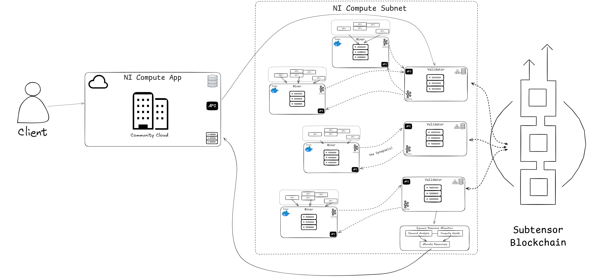

# NI Compute Subnet (Subnet 27)

Welcome to the **Bittensor NI Compute Subnet** repository. This subnet powers a decentralized compute market, enabling **miners** to contribute GPU resources and earn rewards in return. **Validators** measure the performance of these miners and allocate GPU resources accordingly, ensuring an efficient, trustless, and permissionless compute market.

---

## Table of Contents

1. [Introduction](#introduction)
   - [Decentralizing Compute](#decentralizing-compute)
   - [Subnet 27 and Bittensor](#subnet-27-and-bittensor)
2. [Key Resources](#key-resources)
3. [Miner vs. Validator Overview](#miner-vs-validator-overview)
4. [Installation and Prerequisites](#installation-and-prerequisites)
   - [System Requirements](#system-requirements)
   - [Install Docker](#install-docker)
   - [Install Bittensor](#install-bittensor)
   - [Create/Regenerate Keys](#create-or-regenerate-keys)
   - [Clone and Install Compute Subnet](#clone-and-install-compute-subnet)
   - [CUDA Toolkit and GPU Drivers](#cuda-toolkit-and-gpu-drivers)
   - [NVIDIA Docker Support](#nvidia-docker-support)
   - [WandB Setup](#wandb-setup)
   - [PM2 Setup](#pm2-setup)
5. [Networking and Firewall](#networking-and-firewall)
6. [Registering Your Hotkey](#registering-your-hotkey)
7. [Running a Miner](#running-a-miner)
   - [Miner Options](#miner-options)
   - [Checking Miner Logs](#checking-miner-logs)
8. [Running a Validator](#running-a-validator)
   - [Validator Options](#validator-options)
9. [GPU Scoring](#gpu-scoring)
10. [Resource Allocation Mechanism](#resource-allocation-mechanism)
11. [Network Overview Diagram](#network-overview-diagram)
12. [Troubleshooting](#troubleshooting)
13. [Reward Program for Contributions](#reward-program-for-contributions)
14. [License](#license)

---

## Introduction

### Decentralizing Compute
**NI Compute** decentralizes GPU resources by weaving siloed pools of compute into a **trustless** market. This allows for scalable, on-demand GPU power, free from the constraints of centralized providers. Miners add GPU instances to the network, and validators ensure the reliability and performance of these resources.

### Subnet 27 and Bittensor
**NI Compute** is powered by the **Bittensor** network. Bittensor is a blockchain that incentivizes resource providers (miners) who contribute machine intelligence services. In SN27, the resource is **GPU-based compute**, which is crucial for training and running machine learning workloads.

---

## Key Resources

- **NI Compute App (Rent GPUs)**  
  [Cloud Platform](https://app.neuralinternet.ai/)
  
- **Subnet 27 (This Repo)**  
  [GitHub: neuralinternet/compute-subnet](https://github.com/neuralinternet/compute-subnet)

- **Bittensor**  
  [Bittensor Documentation](https://docs.bittensor.com/)  

- **Compute Subnet Discord Channel**  
  [Join Discord](https://discord.gg/ZpaGVXfaCF)

- **Real-Time Compute Subnet Metrics**  
  [OpenCompute Dashboard](https://opencompute.streamlit.app/)

- **Reward Program for Valuable Contributions**  
  [CONTRIBUTING.md](https://github.com/neuralinternet/compute-subnet/blob/main/CONTRIBUTING.md)

> **Note**: We do **not** support container-based (dockerized) GPU platforms such as Runpod, VastAI, or Lambda. We strongly encourage providing your own hardware. If you cannot supply hardware in-house, recommended GPU providers include:
> - Oracle
> - Coreweave
> - FluidStack
> - [Latitude.sh](https://latitude.sh/) (referral code: `BITTENSOR27`)
> - [Oblivus](https://app.oblivus.com/) (referral code: `BITTENSOR27` for 2% cashback)

---

## Miner vs. Validator Overview


### Miner
- **Role**: Contribute resources (GPU instances) to the network.  
- **Rewards**: Performance-based. Higher-performance devices with more GPUs receive higher rewards.  
- **Key Requirements**:  
  - GPU(s) with up-to-date drivers.  
  - Properly opened ports. E.g. 4444 for validator allocations, 8091 for serving the axon.  
  - A registered wallet hotkey on the correct Bittensor subnet (netuid 27 for main, or netuid 15 for test).

### Validator
- **Role**: Verifies the miners' computational integrity, assigns performance scores, and dynamically allocates resources to clients.  
- **Actions**:  
  - Requests performance data (e.g., GPU type, memory) from miners.  
  - Benchmarks or runs tasks to confirm advertised hardware.  
  - Updates scores that determine miners’ reward weights.  
- **Key Requirements**:  
  - A registered wallet hotkey on the correct Bittensor subnet (netuid 27 for main, or netuid 15 for test).
  - Up-to-date code to ensure accurate scoring.

---

## Installation and Prerequisites

### System Requirements
- **Operating System**: Ubuntu 22.04 (recommended) or higher.
- **Python**: 3.10 or higher.
- **GPU**: NVIDIA GPU (recommended).

> **Important**: Each UID is limited to **one external IP**. **Port 4444 is to be opened** for your miner to be allocated properly. Automatic blacklisting occurs for anomalous behavior.

### Install Docker
A Docker environment is required for miner resource allocation:

1. **Install Docker** on Ubuntu:  
   [Official Docs](https://docs.docker.com/engine/install/ubuntu)

2. **Verify Docker**:
   ```bash
   docker run hello-world
   ```
   This should display a confirmation message with no errors.

### Install Bittensor
1. **Run the one-line installer**:
   ```bash
   /bin/bash -c "$(curl -fsSL https://raw.githubusercontent.com/opentensor/bittensor/master/scripts/install.sh)"
   ```
2. **Verify Installation**:
   ```bash
   btcli --help
   ```
   If you get a command-not-found error, add Bittensor to your PATH:
   ```bash
   echo 'export PATH=$PATH:$(python3 -m site --user-base)/bin' >> ~/.bashrc
   source ~/.bashrc
   ```
which will give you an output similar to below:
```
usage: btcli <command> <command args>

bittensor cli v6.9.4

positional arguments:
  {subnets,s,subnet,root,r,roots,wallet,w,wallets,stake,st,stakes,sudo,su,sudos,legacy,l,info,i}
    subnets (s, subnet)
                        Commands for managing and viewing subnetworks.
    root (r, roots)     Commands for managing and viewing the root network.
    wallet (w, wallets)
                        Commands for managing and viewing wallets.
    stake (st, stakes)  Commands for staking and removing stake from hotkey accounts.
    sudo (su, sudos)    Commands for subnet management
    legacy (l)          Miscellaneous commands.
    info (i)            Instructions for enabling autocompletion for the CLI.

options:
  -h, --help            show this help message and exit
  --print-completion {bash,zsh,tcsh}
                        Print shell tab completion script
```                       
See Bittensor’s documentation for alternative installation instructions.
[Bittensor Documentation](https://docs.bittensor.com/)  

### Create or Regenerate Keys
1. **Create new coldkey** (stores funds):
   ```bash
   btcli w new_coldkey
   ```
2. **Create new hotkey** (used for daily operations e.g. mining/validating/registration):
   ```bash
   btcli w new_hotkey
   ```
3. **Regenerate existing keys** if needed (to import them on this machine):
   ```bash
   btcli w regen_coldkeypub #see below
   btcli w regen_coldkey
   btcli w regen_hotkey
   ```

> **Tip**: For security, you can generate your coldkey on a secure offline machine and only load the public portion onto your miner or validator servers.

### Clone and Install Compute Subnet
1. **Clone the repository**:
   ```bash
   git clone https://github.com/neuralinternet/compute-subnet.git
   cd compute-subnet
   ```
2. **Install dependencies**:
   ```bash
   python3 -m pip install -r requirements.txt
   python3 -m pip install --no-deps -r requirements-compute.txt
   python3 -m pip install -e .
   ```
3. **In case you have missing requirements**:
```
sudo apt -y install ocl-icd-libopencl1 pocl-opencl-icd
```

### CUDA Toolkit and GPU Drivers
> **Tip**: If Nvidia toolkit and drivers are already installed on your machine, scroll down to step 5 to verify then move on to the docker CUDA support.
1. **Download** the latest CUDA from [NVIDIA's official page](https://developer.nvidia.com/cuda-downloads).  
2. **Install** (example for Ubuntu 22.04 (Dec. 2024)):
   ```bash
   wget https://developer.download.nvidia.com/compute/cuda/12.3.1/local_installers/cuda-repo-ubuntu2204-12-3-local_12.3.1-545.23.08-1_amd64.deb
   sudo dpkg -i cuda-repo-ubuntu2204-12-3-local_12.3.1-545.23.08-1_amd64.deb
   sudo cp /var/cuda-repo-ubuntu2204-12-3-local/cuda-*-keyring.gpg /usr/share/keyrings/
   sudo apt-get update
   sudo apt-get -y install cuda-toolkit-12-3
   sudo apt-get -y install cuda-drivers
   ```
3. **Set environment variables**:
   ```bash
   echo "" >> ~/.bashrc
   echo 'export CUDA_VERSION=cuda-12.3' >> ~/.bashrc
   echo 'export PATH="$PATH:/usr/local/$CUDA_VERSION/bin"' >> ~/.bashrc
   echo 'export LD_LIBRARY_PATH="/usr/local/$CUDA_VERSION/lib64:$LD_LIBRARY_PATH"' >> ~/.bashrc
   source ~/.bashrc
4. **Reboot** to finalize changes:
   ```bash
   sudo reboot
   ```
5. **Verify** driver and CUDA:
   ```bash
   nvidia-smi
   nvcc --version
   ```
The output of which should look something like:
```
+---------------------------------------------------------------------------------------+
| NVIDIA-SMI 545.29.06              Driver Version: 545.29.06    CUDA Version: 12.3     |
|-----------------------------------------+----------------------+----------------------+
| GPU  Name                 Persistence-M | Bus-Id        Disp.A | Volatile Uncorr. ECC |
| Fan  Temp   Perf          Pwr:Usage/Cap |         Memory-Usage | GPU-Util  Compute M. |
|                                         |                      |               MIG M. |
|=========================================+======================+======================|
|   0  NVIDIA RTX                     Off | 00000000:05:00.0 Off |                  Off |
| 30%   34C    P0              70W / 300W |  400MiB / 4914000MiB |      4%      Default |
|                                         |                      |                  N/A |
+-----------------------------------------+----------------------+----------------------+
                                                                                         
+---------------------------------------------------------------------------------------+
| Processes:                                                                            |
|  GPU   GI   CI        PID   Type   Process name                            GPU Memory |
|        ID   ID                                                             Usage      |
|=======================================================================================|
|  No running processes found                                                           |
+---------------------------------------------------------------------------------------+
```
```
nvcc: NVIDIA (R) Cuda compiler driver
Copyright (c) 2005-2023 NVIDIA Corporation
Built on Fri_Nov__3_17:16:49_PDT_2023
Cuda compilation tools, release 12.3, V12.3.103
Build cuda_12.3.r12.3/compiler.33492891_0
```

### NVIDIA Docker Support
Enable GPU functionality within Docker containers:

```bash
distribution=$(. /etc/os-release;echo $ID$VERSION_ID)
curl -s -L https://nvidia.github.io/nvidia-docker/gpgkey | sudo apt-key add -
curl -s -L https://nvidia.github.io/nvidia-docker/$distribution/nvidia-docker.list \
  | sudo tee /etc/apt/sources.list.d/nvidia-docker.list
sudo apt update
sudo apt-get install -y nvidia-container-toolkit
sudo apt install -y nvidia-docker2
```

### WandB Setup
1. **Create a free WandB account**: [wandb.ai](https://wandb.ai/)  
2. **Obtain an API Key** and place it into your `.env` file:
   ```bash
   cd compute-subnet
   read -p "Enter WanDB API key: " wandb_api_key && sed -e s/"your_api_key"/"${wandb_api_key}"/ .env.example > .env
3. **Monitor stats** at [WandB: neuralinternet/opencompute](https://wandb.ai/neuralinternet/opencompute)

### PM2 Setup
**PM2** Proccess manager is great for monitoring the operation and helps keep your miner or validator running persistently.

```bash
sudo apt update
sudo apt install npm -y
sudo npm install pm2 -g
pm2 ls
```

---

## Networking and Firewall
Open necessary ports:

1. **Install and configure `ufw`**:
   ```bash
   sudo apt install ufw
   sudo ufw allow 4444
   sudo ufw allow 22/tcp
   sudo ufw allow 8091/tcp #can be altered to a port of your choice. See below in README.md
   sudo ufw enable
   sudo ufw status
   ```
> **Tip**: You can open any ports: `sudo ufw allow xxxx/tcp` and use them as your `axon.port` default e.g. `sudo ufw allow 8091/tcp` and this port would be specified in your pm2 miner proccess arguments as `--axon.port 8091`. If you are using a cloud server it is a good idea to check with your provider if ports are open by default. If you can create your own network rules make sure these inbound rules are applied to the server. Ask your provider for assitance with this netowrking step. 

3. **Add user to docker group** (if not already):
   ```bash
   sudo groupadd docker
   sudo usermod -aG docker $USER
   sudo systemctl start docker
   sudo apt install at  # ensures certain dependencies for Docker
   sudo service docker status  # should show 'active (running)'
   ```

---

## Registering Your Hotkey
You need **$TAO** tokens in your coldkey to register the hotkey on the chosen netuid.

- **Main Network** (netuid = 27, known as `finney`):
  ```bash
  btcli s register --subtensor.network finney --netuid 27
  ```
- **Test Network** (netuid = 15, known as `test`):
  ```bash
  btcli s register --subtensor.network test --netuid 15
  ```

> If you get the error `too many registrations this interval`, wait for the next interval and retry.  
> **Registration cost** can be checked [Here](https://taostats.io/subnets/netuid-27/#registration). Or check using the CLI w/ `btcli s list` (Cost is 'RECYCLE').

---

## Running a Miner
The miner contributes GPU resources to the network. Make sure your ports are open and your environment is set up as described above.

**General Miner Command**:
```bash
pm2 start ./neurons/miner.py --name <MINER_NAME> --interpreter python3 -- \
  --netuid 27 \
  --subtensor.network finney \
  --wallet.name <COLDKEY_NAME> \
  --wallet.hotkey <HOTKEY_NAME> \
  --axon.port 8091 \
  --logging.debug
```

- **`--netuid`**: Subnet ID (27 for main, 15 for test).
- **`--subtensor.network`**: Your Bittensor chain endpoint.  
  - **Main**: `finney`
  - **Test**: `test`  
  - Or use a custom endpoint, e.g. `subvortex.info:9944` (recommended)
- **`--wallet.name`** & **`--wallet.hotkey`**: The coldkey/hotkey names you created [above](#create-or-regenerate-keys) and used in registration (btcli's defaults are `default` and `default` but both can be freely customized)
- **`--axon.port`**: default 8091 can be replaced with any port number allowed by ufw as instructed [above](#networking-and-firewall) to serve your axon. Important for proper functionality and miner<->validator communication.
- **`--ssh.port`**: A port opened with UFW as instructed [above](#networking-and-firewall) (e.g., 4444) used for allocating your miner via ssh.


### Miner Options
- `--miner.whitelist.not.enough.stake`: Whitelist validators lacking sufficient stake (default: False).
- `--miner.whitelist.not.updated`: Whitelist validators not on the latest code version (default: False).
- `--miner.whitelist.updated.threshold`: Quorum threshold (%) before starting the whitelist (default: 60).

### Checking Miner Logs
To inspect your miner’s logs:

```bash
pm2 logs
pm2 monit
```
- **`pm2 logs`** shows rolling log output.
- **`pm2 monit`** provides a live interface with CPU usage, memory, etc.

---

**Note**: Validators are required to operate on a local Subtensor instance (subvortex recommended), as using Finney may result in rate limitations.

## Running a Validator
Validators measure and score miner performance, adjusting on-chain weights accordingly.

**General Validator Command**:
```bash
pm2 start ./neurons/validator.py --name <VALIDATOR_NAME> --interpreter python3 -- \
  --netuid 27 \
  --subtensor.network finney \
  --wallet.name <COLDKEY_NAME> \
  --wallet.hotkey <HOTKEY_NAME> \
  --logging.debug
```

### Validator Options
- `--validator.whitelist.unrecognized`: Whitelist unrecognized miners (default: False).
- `--validator.perform.hardware.query`: Gather hardware specs from miners (default: True).
- `--validator.specs.batch.size`: Batch size for specs queries (default: 64).
- `--validator.force.update.prometheus`: Force upgrade of Prometheus if needed (default: False).
- `--validator.whitelist.updated.threshold`: Quorum threshold (%) before starting the whitelist (default: 60).

---

## GPU Scoring
**Subnet 27** uses a performance-based scoring system centered on GPU hardware. Below are **example base scores**:

| GPU Model                        | Base Score |
|---------------------------------|------------|
| NVIDIA H200                      | 4.00       |
| NVIDIA H100 80GB HBM3           | 3.30       |
| NVIDIA H100                      | 2.80       |
| NVIDIA A100-SXM4-80GB           | 1.90       |
| NVIDIA A100 80GB PCIe           | 1.65       |
| NVIDIA L40s                      | 1.10       |
| NVIDIA L40                       | 1.00       |
| NVIDIA RTX 6000 Ada Generation  | 0.90       |
| NVIDIA RTX A6000                | 0.78       |
| NVIDIA RTX 4090                 | 0.68       |
| NVIDIA GeForce RTX 3090         | 0.43       |
| NVIDIA L4                        | 0.43       |
| NVIDIA A40                       | 0.39       |
| NVIDIA RTX A5000                | 0.36       |
| NVIDIA RTX A4500                | 0.34       |

1. **Base GPU Score**: Tied to the GPU model.  
2. **Scaling**: Up to 8 GPUs can be recognized. The top theoretical scenario (8 of the highest GPU model) is set to 50 points.  

---

## Resource Allocation Mechanism
Validators reserve resources from miners by specifying required CPU, GPU count, memory, etc. The subnet dynamically allocates and deallocates miner resources based on **availability** and **network demands**. A validator can request resources from a miner using scripts such as [neurons/register.py](neurons/register.py). Example resource request:
```
{"cpu":{"count":1}, "gpu":{"count":1}, "hard_disk":{"capacity":10737418240}, "ram":{"capacity":1073741824}}
```

---
## Network Overview Diagram


## Troubleshooting
- **No requests received (no ‘Challenge’ or ‘Specs’ events)**:
  - Check your open ports (default allocation port: 4444). Check your Axon port is open with your machine or cloud provider. Use `pm2 describe <PROCCESS_NAME>` and `pm2 show <PROCCESS_NAME>` to view the arguments you used to run your miner e.g. `--axon.port` and `--ssh.port` and check with `sudo ufw status` that the right ports are open with UFW as well.
  - Check your pm2 logs for any errors or tracebacks to help troubleshoot.
  - Ensure the miner is running properly and not blacklisted.
- **Deregistered unexpectedly**:
  - Competition on the network is high; more powerful devices may outcompete you.
  - Connection or environment issues.  
  - Make sure scripts and Docker containers are running stably.

---

## Reward Program for Contributions
We encourage community involvement in improving **Compute Subnet**. A **bounty program** is in place to reward valuable contributions.  
See the **[Reward Program for Valuable Contributions](https://github.com/neuralinternet/compute-subnet/blob/main/CONTRIBUTING.md)** for details.


---

## License

```
The MIT License (MIT)
© 2023 Neural Internet

Permission is hereby granted, free of charge, to any person obtaining a copy of
this software and associated documentation files (the “Software”), to deal in
the Software without restriction, including without limitation the rights to use,
copy, modify, merge, publish, distribute, sublicense, and/or sell copies of the
Software, and to permit persons to whom the Software is furnished to do so,
subject to the following conditions:

The above copyright notice and this permission notice shall be included in all
copies or substantial portions of the Software.

THE SOFTWARE IS PROVIDED “AS IS”, WITHOUT WARRANTY OF ANY KIND, EXPRESS OR
IMPLIED, INCLUDING BUT NOT LIMITED TO THE WARRANTIES OF MERCHANTABILITY,
FITNESS FOR A PARTICULAR PURPOSE AND NONINFRINGEMENT. IN NO EVENT SHALL THE
AUTHORS OR COPYRIGHT HOLDERS BE LIABLE FOR ANY CLAIM, DAMAGES OR OTHER
LIABILITY, WHETHER IN AN ACTION OF CONTRACT, TORT OR OTHERWISE, ARISING FROM,
OUT OF OR IN CONNECTION WITH THE SOFTWARE OR THE USE OR OTHER DEALINGS IN
THE SOFTWARE.
```
```
